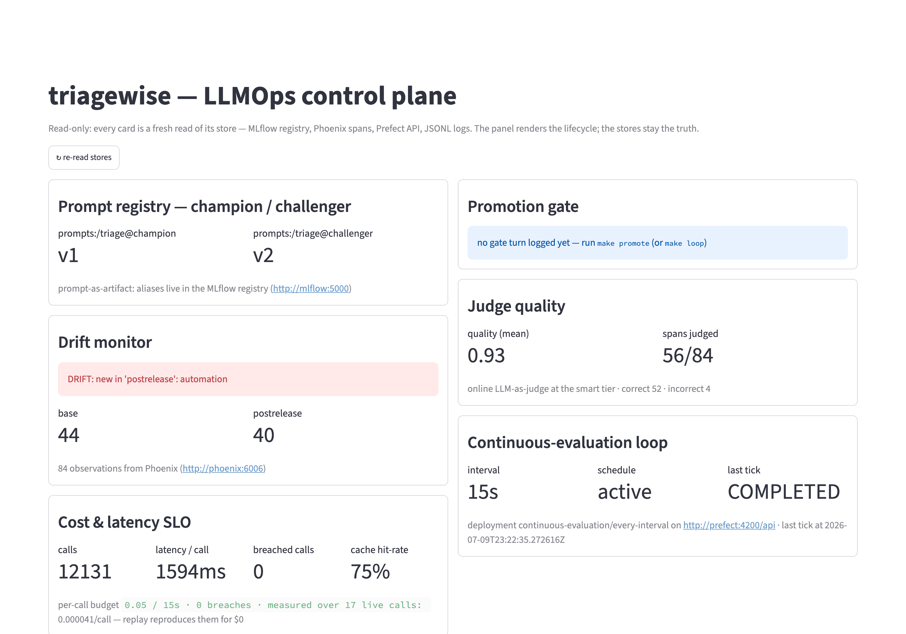
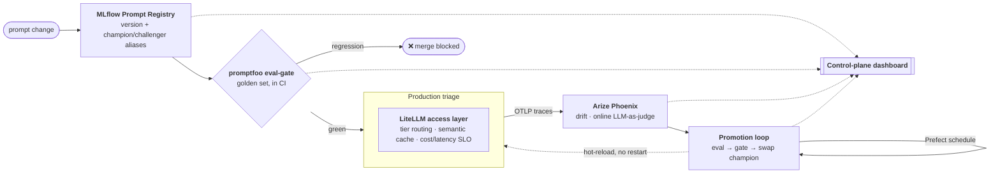
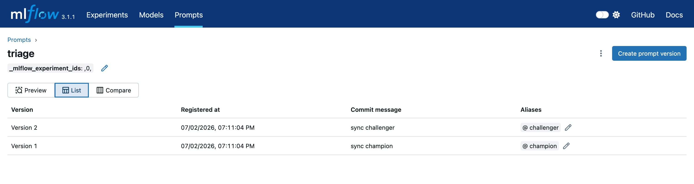
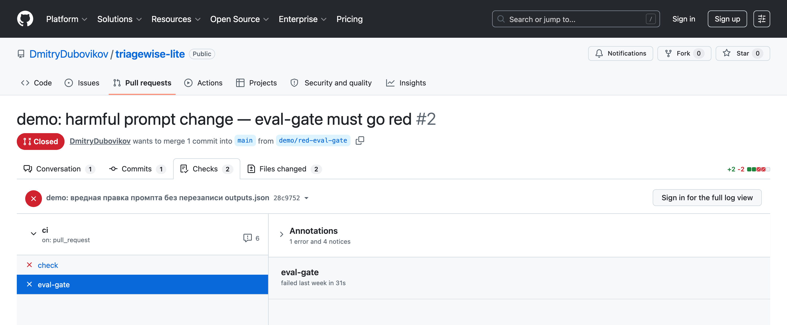
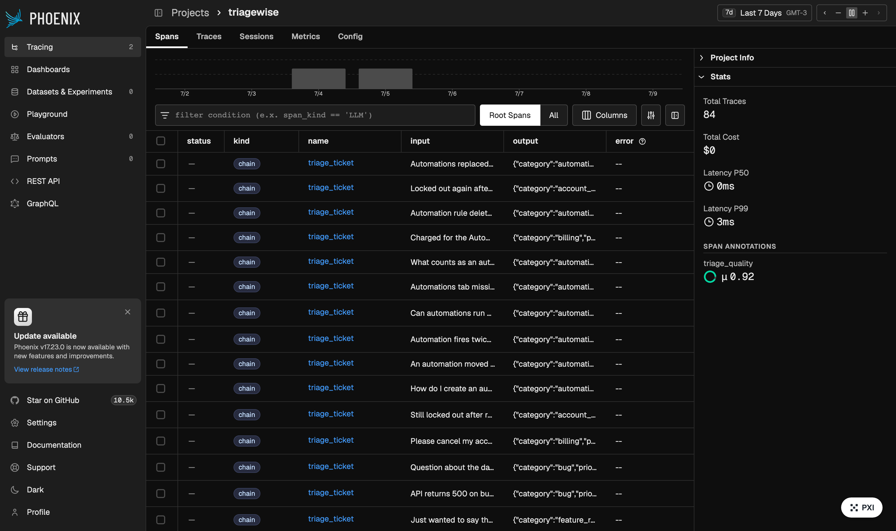
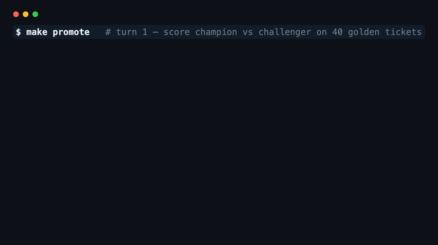
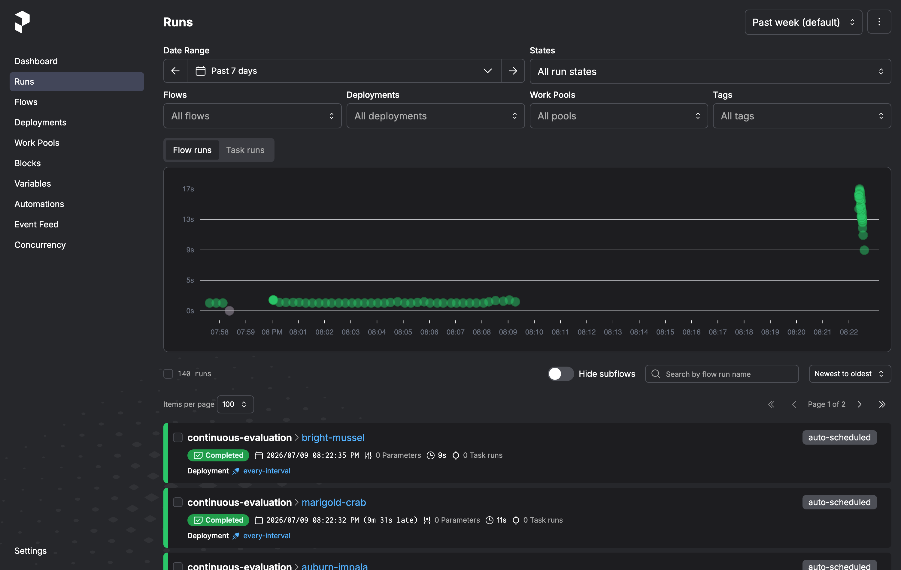
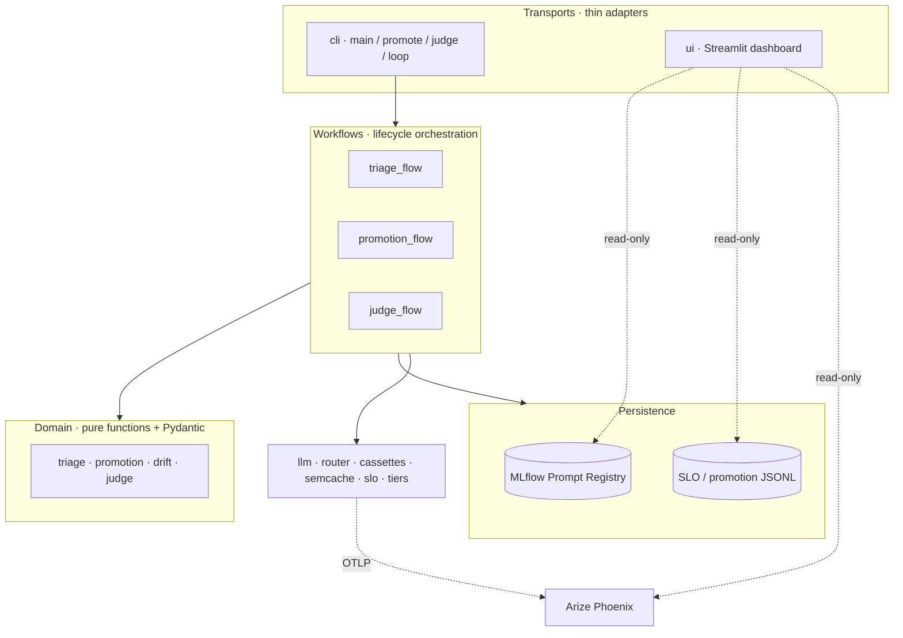

# triagewise

> **An LLMOps control plane for a production LLM task.** It triages support tickets for a
> fictional SaaS (*Driftwood*) into `{category, priority, sentiment, needs_human, draft_reply}`,
> and operates that model the way production software is run: a prompt registry, a CI eval-gate
> that blocks merges, cost/latency SLOs, online drift monitoring, and a continuous-evaluation
> loop that promotes prompts on a schedule.

<p align="center">
  
</p>

🧬 prompts are **versioned artifacts** with movable `champion`/`challenger` aliases ·
🚦 a **regressed prompt can't merge** · 💸 every call carries a **cost/latency SLO** ·
📉 **drift is caught by data**, not complaints · 🔁 the loop **promotes on a schedule** ·
🆓 every proof runs offline for **$0**

**What this demonstrates:** end-to-end **LLMOps** — prompt-as-artifact versioning &
champion/challenger promotion, CI eval-gates, cost/latency SLOs, online drift + LLM-as-judge
monitoring, and a scheduled continuous-evaluation loop.

📸 **Showcase below** · 🚀 **[Run it](#run-it)** · 🧭 **[Engineering decisions → docs/tech-decisions.md](docs/tech-decisions.md)**

---

## What this is

**The operational lifecycle around the model is the product** — the registry, the eval-gate, the
routing, the monitoring, the promotion loop. Every capability here is proven, not asserted: a
prompt version resolves by alias, a regressed prompt turns CI red, Phoenix actually draws the
drift, and the champion alias swaps in the store.

Three tools carry the lifecycle: **MLflow Prompt Registry**, **promptfoo**, and **Arize Phoenix**.
Underneath sits the plumbing that makes them run offline and for free — LiteLLM (SDK-only), Prefect,
DVC, Docker Compose, and record/replay cassettes.

## The LLM lifecycle, end to end

Read the table as a lifecycle: a prompt change is **registered**,
**gated** in CI, **run** in production, **observed**, then **promoted** — automatically, on a
schedule — and the whole loop is **legible** on one screen.

| Stage | Capability | Tool | Proof |
|---|---|---|---|
| **Register** | Prompt-as-artifact + `champion`/`challenger` aliases | MLflow Prompt Registry | [🖼](#register--a-prompt-is-a-versioned-artifact) |
| **Gate** | CI eval-gate / regression testing — blocks the merge | promptfoo · DVC golden set | [🖼](#gate--a-regressed-prompt-cant-merge) |
| **Run** | Cost & latency SLO (LLM FinOps) + tier routing | LiteLLM (SDK-only) | [⌨️](#run--every-call-has-a-costlatency-slo) |
| **Run** | Productionized routing + semantic caching | LiteLLM + fastembed | [⌨️](#run--semantic-cache-a-close-enough-repeat-skips-the-network) |
| **Observe** | LLM output drift / quality monitoring | Arize Phoenix | [⌨️](#observe--drift-is-caught-by-data) |
| **Observe** | Online evaluation / LLM-as-judge in prod | Arize Phoenix | [🖼](#observe--tracing--online-llm-as-judge) |
| **Promote** | Champion/challenger promotion — CD for prompts | MLflow (eval → gate → swap → hot-reload) | [🎞](#promote--champion-challenger-cd-for-prompts) |
| **Schedule** | Continuous-evaluation loop | Prefect | [🖼](#schedule--continuous-evaluation-on-a-clock) |
| **See** | Lifecycle made legible — 6 proofs on one screen | Streamlit (read-only UI) | [🖼](#see--the-control-plane-on-one-screen) |

## The lifecycle in one picture



---

# Proof, capability by capability

Each claim below has a screenshot, a GIF, or a real command output behind it. Everything runs
in `replay` mode against committed cassettes — **$0, no API key, deterministic**.

## Register — a prompt is a versioned artifact

The triage prompt lives in the **MLflow Prompt Registry**, not in code. It has a version history
(`v1`, `v2`, …) and two movable role-aliases: `champion` (what production loads) and `challenger`
(the candidate under test). Production asks the registry for `prompts:/triage@champion` — never a
version number, never a hardcoded string — so a promotion is an alias move, not a code change.



## Gate — a regressed prompt can't merge

The golden set (40 labeled tickets, **DVC-versioned**) is an exam the prompt must keep passing.
**promptfoo** replays recorded outputs over it and asserts the output contract (`TriageResult`
JSON, valid fields). It runs on every push and PR — offline, no key. A gate that can't turn red
isn't a gate, so here it is on a real PR that deliberately broke the prompt: **`eval-gate` failed,
and the merge was blocked.**



## Run — every call has a cost/latency SLO

The **LiteLLM access layer** (SDK-only — see [the security note](#architecture--seams)) is the one
chokepoint every LLM call passes through. It routes by *tier* (`cheap`↔`smart`, an env flag, not a
code edit) and writes a per-call SLO record: tier, pinned model snapshot, latency, dollar cost, and
whether it breached a budget.

```jsonc
// logs/llm_calls.jsonl — one line per routed call
{"tier":"cheap","model":"gpt-4.1-nano-2025-04-14","mode":"replay",
 "latency_ms":281.1,"cost_usd":0.0000377,"cost_source":"cassette",
 "cache":"miss","slo_breaches":[]}
```

Models are the *only* thing named in `llm-tiers.yaml`, and each must be a **dated snapshot**
(`-YYYY-MM-DD`, mechanically enforced) — a floating alias would let the cloud silently drift under
a project that is *about* drift.

## Run — semantic cache: a close-enough repeat skips the network

A semantic cache sits on top of the access layer: a paraphrase of an already-seen ticket is served
from cache — no cassette, no network — with similarity scored by a local embedding model (`$0`).
The outcome (`hit`/`miss`/`off`) lands in the same SLO log, and `make cache-stats` turns it into a
number.

```jsonc
{"cache":"hit","latency_ms":162.3,"cost_usd":0.0,"cost_source":"none"}   // a semantic hit — zero network
```
```json
$ make cache-stats
{ "cached_path_calls": 4, "hits": 3, "hit_rate": 0.75 }
```

## Observe — drift is caught by data

The synthetic traffic ships in two batches: a base batch and a **post-release** batch that
introduces a brand-new category (`automation`). Both are traced to Phoenix; `make drift-report`
reads Phoenix's span store and returns a verdict — and exits non-zero only when the new category is
actually caught. No customer complaint required.

```json
$ make drift-report
{ "new_categories": ["automation"], "drifted": true,
  "by_batch": { "postrelease": { "automation": 32, "account_access": 4, "billing": 4 } } }
DRIFT: new categories in 'postrelease': automation
```

## Observe — tracing + online LLM-as-judge

Every triage is an OpenTelemetry span in **Arize Phoenix**. On top of raw traces, a stronger model
(`smart` tier) re-reads a sampled half of the traffic and annotates each span
correct/incorrect — an **online LLM-as-judge**, catching quiet quality decay that a category-drift
monitor structurally can't. The `triage_quality` annotation (mean **0.92**) rides right next to the
traces.



## Promote — champion / challenger, CD for prompts

The manual core of continuous evaluation, and the whole point of the registry: score both aliases
on the golden set, apply a **strict gate**, and on a challenger win **swap the `champion` alias in
the store** — verified by re-reading the registry (trust the store, not the UI). The live
process picks up the new champion on its next call — **hot-reload, no restart**. And it's
**idempotent**: run it again and the gate finds no strict winner, so nothing moves.



## Schedule — continuous evaluation on a clock

**Prefect** wraps that same promotion turn in a scheduled flow: every interval, a tick reruns
eval → gate → swap. This is the LLM analog of continuous training — the champion keeps earning its
place instead of being trusted forever.



## See — the control plane on one screen

Finally, a **read-only** Streamlit dashboard collects six live lifecycle proofs onto one screen —
champion/challenger versions, the last gate verdict, drift status, online judge quality, the
cost/latency SLO, and the loop's schedule. It only *reads* the stores; the stores stay the source
of truth. (It's the [hero image](#triagewise) at the top.) Streamlit is only the renderer here —
the substance is the visible control plane, not the framework that draws it.

---

## Architecture & seams

Dependencies point one way: **transport → workflow → domain/persistence**. The domain core is pure
functions and schemas (triage parsing, the gate decision) with no I/O; the registry handle is
opened at the boundary and passed down; env is read only through `Settings`. The `llm/` package is
cross-cutting (router, cassettes, semantic cache, SLO, tiers).



**LiteLLM discipline (a security red line, not a nicety).** LiteLLM is used **SDK-only, never the
Proxy** (the Proxy is a CVE surface). One bare `acompletion` call, **no callbacks** (each is a leak
channel), **telemetry off**, lazy import, pinned version + `uv.lock`, keys only via `Settings`. The
blast radius is a single outbound call we control — and a pytest enforces it, so the rule can't rot
into a comment. It is deliberately an *access layer*, not a "gateway" — the SDK never becomes a
long-running proxy service.

## Run it

Offline and free by default — cassettes replay recorded outputs, so nothing hits the network.

```bash
uv sync --extra dev
cp .env.example .env
make up                              # MLflow :5050 · Phoenix :6006 · Prefect :4200 · dashboard :8501

uv run python -m scripts.register_prompt   # register the prompt (registry only, $0)
uv run python -m app.cli.main DW-001       # triage one ticket (replay, $0)

make traffic        # both ticket batches → triage, traced to Phoenix   ($0)
make drift-report   # drift verdict from Phoenix's span store            ($0)
make promote        # champion/challenger promotion turn, idempotent     ($0)
make eval           # the CI eval-gate locally (needs: nvm use && npm ci) ($0)
make check          # ruff + mypy + pytest — the static gate             ($0)
make down
```

The two genuinely **live** steps (they cost money and want `OPENAI_API_KEY`) are re-recording
cassettes and running the online judge (`make judge`, ~$0.002/span) — everything else is `$0`.
`LLM_MODE=replay` is the default; `record`/`live` hit OpenAI and are gated by an explicit go.
The golden set is DVC-versioned — `uv run dvc pull` restores it. Every make target (including the
continuous-evaluation loop, `make loop`) is listed in the `Makefile`.

## What this puts on a résumé

- *Built an **LLMOps control plane**: a prompt registry with champion/challenger promotion, CI
  eval-gates (promptfoo) over a versioned golden set, and an automated continuous-evaluation loop.*
- *Operated LLMs in production via a **LiteLLM-SDK access layer** with cost/latency SLOs, semantic
  caching, and **online LLM-as-judge** drift monitoring (Arize Phoenix).*

`LLMOps · LiteLLM · promptfoo · MLflow Prompt Registry · Arize Phoenix · prompt versioning · LLM eval-gates · continuous evaluation`
